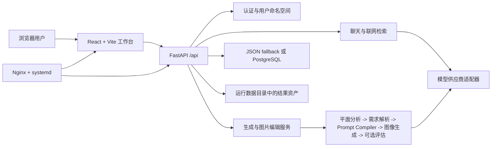

# Attuno 技术文档

> 最后核对：2026-07-11
>
> 范围：当前仓库 `main` 中的实现结构。接口和运行状态以代码、部署环境变量及 [项目进度](project-status.md) 为准。

## 1. 架构概览

## 2. 目录职责

| 路径 | 职责 |
| --- | --- |
| `attuno-studio/ui-prototype/` | Vite + React 前端工作台、API 客户端、组件、样式和静态测试 |
| `attuno-studio/backend/app/routes/` | FastAPI HTTP 路由层 |
| `attuno-studio/backend/app/services/` | 认证、存储、聊天、生成、图片编辑、联网搜索、系统状态和更新服务 |
| `attuno-studio/backend/app/db/migrations/` | PostgreSQL schema migration |
| `attuno-studio/agents/` | 平面图分析、需求解析、提示词生成/编译、路由与评估 |
| `attuno-studio/adapters/` | 不同模型 API 格式的适配器 |
| `attuno-studio/pipeline.py` | 图像生成主流程与迭代策略 |
| `attuno-studio/tests/` | 后端单元、接口与 PostgreSQL 集成测试 |
| `deploy/` | Ubuntu 安装、更新、systemd 与 Nginx 示例 |
| `.trellis/` | 项目工作流、规范和历史任务记录 |

## 3. 主要运行链路

### 3.1 日常聊天

1. 前端通过 `/api/chat` 或 `/api/chat/stream` 发送消息、最近上下文、附件和当前供应商配置。
2. `DesignChatAgent` 先给出意图、建议动作、记忆候选和图像工作流草稿。
3. 普通聊天路径由规则和可选模型决策判断是否联网搜索。
4. 如果需要搜索，服务端构建上下文后再使用用户配置的聊天模型生成回答。
5. 前端用 SSE 显示路由、搜索、模型输出和完成状态。

### 3.2 图像生成

1. 前端提交 `multipart/form-data` 到 `/api/generate` 或 `/api/generate/stream`。
2. 服务端解析 `GenerateForm`，加载当前账号项目的风格偏好和模型配置。
3. Pipeline 根据模式执行：平面图分析、需求解析、提示词生成或 Prompt Compiler、图像调用、可选评估/迭代。
4. 结果、提示词、评估、来源文件和输出路径写入用户数据命名空间。
5. 前端把结果加入聊天时间线和结果库，并可继续执行编辑、标注编辑或对比。

### 3.3 聊天历史加载

1. 前端优先从账号 scoped localStorage 恢复可显示的会话。
2. `GET /api/chat-history?summary=1` 返回不含完整 `messages` 的摘要列表。
3. 用户打开摘要会话时，前端再调用 `GET /api/chat-history/{session_id}` 拉取完整消息。
4. 保存历史时，服务端会将摘要占位与既有完整消息合并，避免空消息覆盖。

## 4. API 边界

| API 组 | 主要职责 |
| --- | --- |
| `/api/auth/*` | 注册、登录、退出、当前用户 |
| `/api/chat/*` | 日常聊天、流式聊天、记忆写入 |
| `/api/chat-history/*` | 会话摘要、单会话详情和完整历史保存 |
| `/api/config/*` | 多供应商配置、连通性验证和模型列表 |
| `/api/generate*` | 图像生成与 SSE 进度 |
| `/api/results/*` | 结果列表、资产读取、下载、笔记、编辑和标注编辑 |
| `/api/preferences/*` | 快捷短语、提示词模式、风格偏好和记忆 |
| `/api/system/*` | 受管理员认证保护的系统状态与 GitHub Release 更新 |
| `/api/health` | 服务与数据库健康状态 |

路由只处理 HTTP 参数、认证和响应。业务规则应保持在 `services/`，图像推理策略保持在 `agents/` 和 `pipeline.py`。

## 5. 存储、认证与数据隔离

### 5.1 存储策略

* 开发环境未设置 `DATABASE_URL` 时使用 JSON fallback。
* 生产环境要求 PostgreSQL；启动时运行 `backend/app/db/migrations/` 下的 migration。
* 用户结果资产、配置和输出应位于 `ATTUNO_STUDIO_DATA_DIR` 指定的运行数据目录，而不是 Git 工作树。
* 聊天历史当前仍以每用户完整 payload 存储。摘要接口减少了传输和前端解析量，但数据库层仍需要读取完整 payload 生成摘要。

### 5.2 认证与隔离

* 用户密码使用 PBKDF2-HMAC-SHA256 加盐哈希。
* 登录状态通过 HttpOnly Cookie 保存，服务端会话默认有效期为 14 天。
* 路由通过当前登录用户或兼容的命名空间用户解析用户 ID；配置、历史、偏好、搜索状态和结果均按用户 ID 隔离。
* 生产部署需补充 HTTPS 下的 Secure Cookie、会话刷新/撤销策略、登录限流和 CSRF 策略的明确配置与测试。当前实现不应被当作完整安全基线。

## 6. 模型与提示词

* `adapters/` 提供 OpenAI 兼容、Anthropic、Google 等供应商封装。
* 模型配置可按账号保存多个分析/聊天和图像供应商档案。
* `render3d` 由 `agents/prompt_compiler.py` 编译结构优先提示词，核心顺序是：
  `墙体/门窗/固定结构 > 房间用途与相邻关系 > 家具数量与朝向 > 材质风格`。
* 质量评估目前通过 `enable_quality_evaluation` 请求字段控制，默认值为关闭。模型返回图片并不表示结构或风格已经达标。

## 7. 前端实现

* 前端使用 React 18、TypeScript 和 Vite；API 调用集中在 `src/api/`。
* 通用领域类型位于 `src/types/domain.ts`，会话辅助逻辑位于 `src/utils/chatSessions.ts`。
* 页面目前仍以 `src/App.tsx` 为主要状态中枢，约 9,270 行，承担认证、聊天、生成、结果、偏好和布局协调等职责。
* 已有部分领域组件和 API 模块，但下一步应继续提取会话、生成、结果库和配置状态，降低交叉修改风险。

## 8. 部署与运维

### 本地开发

* 根目录 `start_attuno_studio.bat` 可启动前后端。
* API 默认监听 `127.0.0.1:8787`；Vite 开发服务器端口由 `VITE_PORT` 控制。

### Ubuntu VPS

* `deploy/install.sh`：创建 Python 环境、安装依赖、构建前端，并保留既有配置。
* `deploy/update.sh`：fast-forward 拉取或 release checkout 后更新依赖、迁移数据库、构建前端、重启 API、检查健康并 reload Nginx。
* systemd 运行 FastAPI，Nginx 托管 `ui-prototype/dist` 并反向代理 `/api`。
* Web 更新接口只使用服务端推导的 GitHub latest release，不接受前端提供的任意 tag、分支或 shell 命令。

## 9. 测试与验证

| 范围 | 当前方式 |
| --- | --- |
| 后端 | `python -m pytest tests -q` |
| PostgreSQL 集成 | 设置 `TEST_DATABASE_URL` 后运行 `tests/test_postgres_storage_integration.py` |
| 前端构建 | `npm run build` |
| 前端静态测试 | `npm run test:chat-api`、`test:chat-sessions`、`test:composer-layout` 等独立脚本 |
| 部署脚本 | `bash -n deploy/install.sh` 与 `bash -n deploy/update.sh` |

仓库当前没有发现 `.github/` CI 工作流，也没有版本标签。因此测试仍依赖开发者或部署前流程主动执行，发布可追溯性需要优先补强。

## 10. 主要技术债

| 优先级 | 问题 | 影响 | 建议 |
| --- | --- | --- | --- |
| P0 | 缺少 CI、Release/Tag 纪律和环境版本报告 | 变更与部署难以稳定复现 | 增加 GitHub Actions、版本标签和发布检查清单 |
| P0 | 生产安全配置尚未形成完整基线 | 会话和管理员接口存在部署配置风险 | Secure Cookie、HTTPS、限流、CSRF、审计和密钥轮换 |
| P1 | `App.tsx` 仍是巨型状态中枢 | 修改成本高，跨功能回归风险大 | 分阶段提取 `useStudioSession`、生成、结果库和配置状态 |
| P1 | 聊天历史仍是完整 payload 存储 | 数据量增长后服务端读取和保存成本高 | 拆分会话/消息、分页和增量保存 |
| P1 | Benchmark 样例引用的平面图资产未纳入 Git | 新环境无法可靠复现评测 | 纳入可脱敏 fixture 或受控测试资产仓库 |
| P1 | 质量评估默认关闭 | 无法持续量化生成质量与回归 | 明确快速/复核模式，保存结构化评估结果 |
